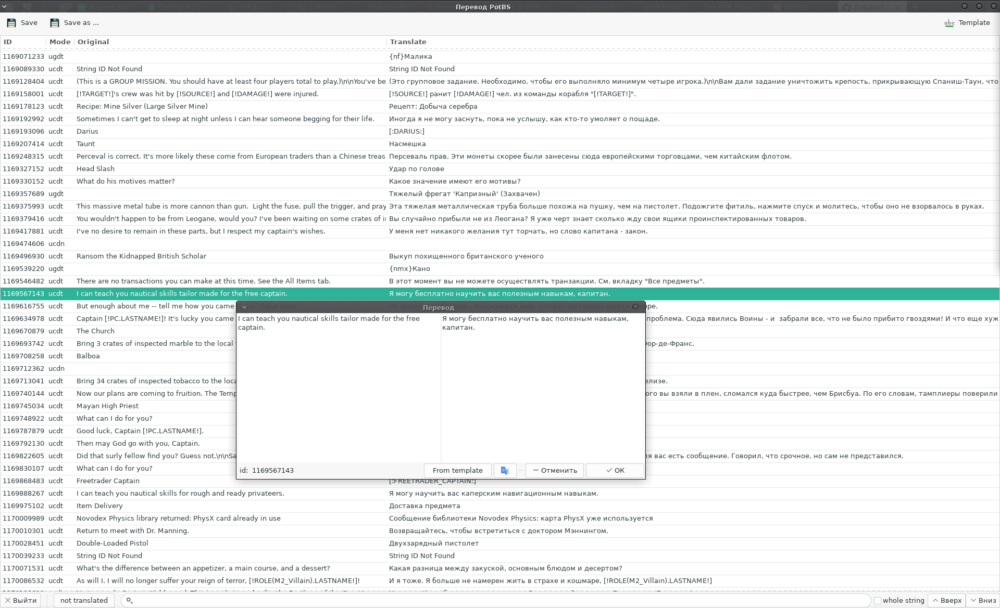

# PotBS_LangUI
Графическая программа для перевода языковых файлов SOE T4.  
T4 используется в играх:
* Корсары Онлайн: Pirates of the burning sea
* EverQuest 2
* PlanetSide 2
* H1Z1
* ...

Написана на [Go](https://golang.org/) с использованием [gotk3](https://github.com/gotk3/gotk3)
* При сохранении DAT файла перевода формирует для него DIR файл.
* Поддерживает шаблоны переводов.
* Поддержка Google Translate.
* Поддержка проверки перевода (Макрос закрыт, макрос не переведен...)

## Установка / Install
Скачать [актуальный релиз](https://github.com/SnakeSel/PotBS_LangUI/releases)  / Download [release](https://github.com/SnakeSel/PotBS_LangUI/releases)  
Распаковать архив и запустить / Unpack and run:
- Windows: `potbs_langui.exe`
- Linux: `./potbs_langui`

## Сборка из исходников / Build from sourse
#### Необходимо установить пакеты разработки GTK3:
- Windows: [msys2](https://www.gtk.org/docs/installations/windows/#using-gtk-from-msys2-packages) или [Chocolatey](https://github.com/gotk3/gotk3/wiki/Installing-on-Windows)
- [Linux](https://github.com/gotk3/gotk3/wiki/Installing-on-Linux)

#### Download PotBS_LangUI:
```sh
$ go get github.com/snakesel/potbs_langui/
```
#### Go to the PotBS_LangUI directory:
```sh
$ cd $GOPATH/src/github.com/snakesel/potbs_langui/
```
#### Build:
- Windows:
```sh
go build -ldflags "-H=windowsgui -s -w"
```
- Linux:
```sh
go build
```
#### Running:
```sh
./potbs_langui
```
